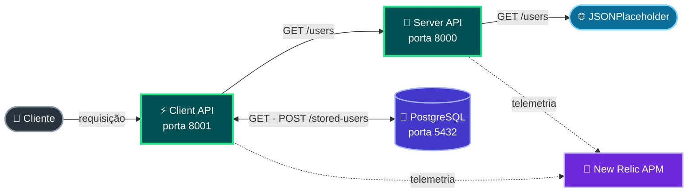

# Simple API Project

Projeto de exemplo composto por duas APIs FastAPI instrumentadas com o agente
APM do New Relic.

- **Server API:** consulta a API pública JSONPlaceholder em `/users`.
- **Client API:** consulta a Server API, devolve os usuários e persiste usuários
  no PostgreSQL por meio de `/stored-users`.
- **New Relic:** monitora as duas aplicações por meio do agente Python.

## Arquitetura

O Docker Compose executa as duas APIs a partir da mesma imagem:

| Serviço | Endereço | Função |
| --- | --- | --- |
| Server API | `http://localhost:8000` | Integração com o JSONPlaceholder |
| Client API | `http://localhost:8001` | Consumo da Server API e acesso ao PostgreSQL |
| PostgreSQL | `localhost:5433` | Persistência usada pelo Client |

Os containers compartilham o namespace de rede para que o Client possa acessar
o Server pelo endereço `127.0.0.1:8000`, conforme definido pela aplicação.

## Fluxo da aplicação



---

**Legenda:** `──` fluxo de negócio · `· · ·` telemetria APM

## Estrutura do projeto

```text
simple-api-project/
├── apps/
│   ├── client/                 # API cliente
│   └── server/                 # API intermediária
├── config/
│   └── newrelic.ini            # Configuração do agente APM
├── docker/
│   ├── app.Dockerfile          # Imagem executável das APIs
│   └── newrelic.Dockerfile     # Imagem-base dedicada do agente
├── scripts/
│   └── generate-traffic.sh     # Gerador contínuo de requisições
├── .env                        # Credenciais locais, ignoradas pelo Git
├── .env.example                # Modelo de configuração sem credenciais
├── compose.yaml
├── requirements.txt
└── README.md
```

## Requisitos

- Docker
- Docker Compose
- Uma chave de licença válida do New Relic

## Configuração

As configurações do New Relic ficam no arquivo `.env` da raiz:

Use o `.env.example` como modelo para ambientes novos:

```bash
cp .env.example .env
```

Depois, preencha as variáveis:

```dotenv
NEW_RELIC_LICENSE_KEY=sua-chave-do-new-relic
NEW_RELIC_APP_NAME=Client-Server API
POSTGRES_DB=myapp
POSTGRES_USER=myapp_user
POSTGRES_PASSWORD=myapp_password
DATABASE_URL=postgresql+psycopg://myapp_user:myapp_password@db:5432/myapp
```

O `.env` está ignorado pelo Git para evitar a publicação da chave.
O Compose usa esse nome como prefixo e registra duas aplicações no New Relic:
`Client-Server API | Client` e `Client-Server API | Server`.

## Como executar

Na raiz do projeto, construa as imagens e inicie os serviços:

```bash
docker compose up --build
```

Para executar em segundo plano:

```bash
docker compose up --build -d
```

Verifique o estado dos containers:

```bash
docker compose ps
```

## Endpoints

### Server API

```text
GET http://localhost:8000/
GET http://localhost:8000/users
```

### Client API

```text
GET http://localhost:8001/
GET http://localhost:8001/users
GET http://localhost:8001/stored-users
POST http://localhost:8001/stored-users
```

Para cadastrar um usuário no PostgreSQL por meio do Client:

```bash
curl -X POST http://localhost:8001/stored-users \
  -H 'Content-Type: application/json' \
  -d '{"name":"Ada Lovelace","username":"ada","email":"ada@example.com"}'
```

A documentação interativa do FastAPI está disponível em:

```text
http://localhost:8000/docs
http://localhost:8001/docs
```

## Instalação local das dependências

O build da imagem instala automaticamente o `requirements.txt`. Para executar
a aplicação fora do Docker, crie um ambiente virtual e instale as dependências:

```bash
python3 -m venv .venv
source .venv/bin/activate
python -m pip install --upgrade pip
python -m pip install -r requirements.txt
```

Use `deactivate` para sair do ambiente virtual.

## Logs

Para acompanhar os logs dos dois serviços:

```bash
docker compose logs -f
```

Para acompanhar apenas um serviço:

```bash
docker compose logs -f server
docker compose logs -f client
```

## Gerar tráfego para o New Relic

Com os serviços em execução, rode o gerador de tráfego em outro terminal:

```bash
./scripts/generate-traffic.sh
```

O script envia cinco requisições concorrentes por padrão. O tráfego é dividido
entre o fluxo Client API → Server API → JSONPlaceholder, consultas do Client
ao PostgreSQL por meio de `GET /stored-users`, health checks e erros HTTP
`404` ou `405`.
Encerre com `Ctrl+C`.

A concorrência, o intervalo entre lotes, o timeout e a distribuição do tráfego
podem ser personalizados:

```bash
CONCURRENCY=10 REQUEST_INTERVAL=0.05 REQUEST_TIMEOUT=10 \
ERROR_RATE=5 ROOT_RATE=10 DB_READ_RATE=30 \
BASE_URL=http://localhost:8001 \
./scripts/generate-traffic.sh
```

`DB_READ_RATE` define a porcentagem de requisições ao Client que executa uma
consulta no PostgreSQL. A soma de `ERROR_RATE`, `ROOT_RATE` e `DB_READ_RATE`
deve ser no máximo 100; o percentual restante percorre o fluxo completo entre
as APIs.

## Encerramento

Para parar e remover os containers e a rede do projeto:

```bash
docker compose down
```
